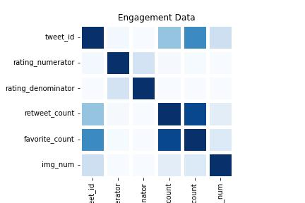

# WeRateDogs Twitter Data
> **Mariam Garuba**

### Gathering Data
The project gathers three pieces of data as described below:
- Twitter archive file: This can be downloaded manually via [twitter_archive_enhanced.csv](https://d17h27t6h515a5.cloudfront.net/topher/2017/August/59a4e958_twitter-archive-enhanced/twitter-archive-enhanced.csv) and read into a pandas DataFrame.

- The tweet image predictions: This is present in each tweet according to a neural network. It is hosted on Udacity's servers and should be downloaded programmatically using the Requests library and the following URL: [tweet_image_predictions](https://d17h27t6h515a5.cloudfront.net/topher/2017/August/599fd2ad_image-predictions/image-predictions.tsv). The results is a table full of image predictions (the top three only) alongside each tweet ID, image URL, and the image number that corresponds to the most confident prediction (numbered 1 to 4 since tweets can have up to four images).

- [Tweet JSON data](https://github.com/Mariam-Garuba/WeRateDogs/blob/main/tweet-json.txt) should be read line by line into a pandas DataFrame.
______

## Assessing Data
After gathering all three pieces of data, assess them visually and programmatically for quality and tidiness issues. Detect and document at least eight (8) quality issues and two (2) tidiness issues.

You need to use two types of assessment:

- Visual assessment: each piece of gathered data is displayed in the Jupyter Notebook for visual assessment purposes. Once displayed, data can additionally be assessed in an external application (e.g. Excel, text editor).
- Programmatic assessment: pandas' functions and/or methods are used to assess the data.
________

### Quality

>#### twitter_archive table
>1. Remove the leading html tags from the `source` column.
>2. Remove records that are retweeted and replied.
>3. drop columns with null values.
>4. convert datatypes of `timestamp` and `tweet_id` columns
>5. non-dog names in `name` column 
>6. drop null values in the `expanded_urls` column
>7. extract the ratings from `text` column 
>8. extract correct values for `rating_numerator` and `rating_denominator` 
>9. change `rating_numerator` datatype to float 
>10  change `rating_denominator` datatype to int

________

### Tidiness  
>1. Melt the `doggo`, `floofer`, `pupper` and `puppo` columns as dog_stages column.
>2. merge the three tables as one and drop all duplicated rows.
_______

## Cleaning Data

>- Before you perform the cleaning, you will make a copy of the original data.
>- Clean all of the issues you documented while assessing.
>- During cleaning, use the **define-code-test framework** and clearly document it.
>- Cleaning includes merging individual pieces of data according to the rules of tidy data. The result should be a high-quality >and tidy master pandas DataFrame (or DataFrames, if appropriate).
_______

### Insights

- There is a positive correlation of 0.91 between the favorite count and retweet count variables. However, the numerator and denominator rating variables show minimal relationships.
- Mean demoninator votes above 10 have significantly higher favorite and retweet counts.
- Uploading more images does not ultimately lead to better engagement, as posts with 3 images express a decline in favorite and retweet counts.
